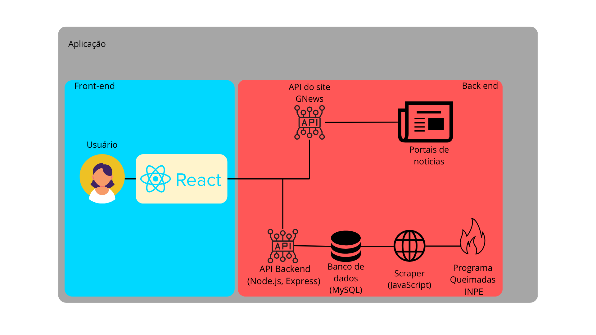

# Arquitetura do Sistema | ChamaControl

## Introdução

O **ChamaControl** é um sistema desenvolvido para visualização de queimadas pelo território brasileiro, fornecendo uma interface interativa para visualização de dados relacionados a focos de incêndio. O projeto é estruturado em uma arquitetura baseada em **backend e frontend**.

### Diagrama de Arquitetura

### Fluxo de Trabalho

- **Coleta de dados:** É realizada diariamente às 12 horas e obtém a quantidade de focos registrada no dia.

- **Armazenamento:** Após os dados serem processados, eles são armazenados no banco de dados MySQL.

- **Visualização:** Os dados obtidos são apresentados no nosso site através de gráficos para facilitar a compreensão.

## Ferramentas e Tecnologias Utilizadas

- **Front-end:** React, HTML, CSS 
- **Back-end:** Node.js, Express
- **Banco de Dados:** MySQL
- **Scraper:** JavaScript
- **Ferramentas:** Docker, Docker-compose, Postman, Swagger

## Backend

O backend é responsável por fornecer uma API que disponibiliza os dados sobre focos de incêndio armazenados no banco de dados. As consultas são realizadas utilizando parâmetros específicos que retornam os dados formatados com base nas necessidades do usuário. A API é construída utilizando **Node.js** e **Express**.

A documentação da API do ChamaControl pode ser encontrada [aqui](https://chama-control-95b7a5960e80.herokuapp.com/api-docs)

### Coleta de dados

A coleta de dados é realizada através dos dados do [INPE](https://terrabrasilis.dpi.inpe.br/queimadas/portal/dados-abertos/#da-focos). Esses dados são disponibilizados em arquivos `.csv`, que são baixados, lidos, processados e armazenados no banco de dados.

O ChamaControl possui 3 scrapers, são eles:

- **processaDadosAnual:** É responsável por popular o banco de dados com a quantidade mensal de focos registradas de cada estado no período de 2003 a 2024. (excutado apenas uma vez)
- **processaDadosDiarios30Dias:** É responsável por popular o banco de dados com a quantidade de focos registrados de cada estado diariamente nos últimos 30 dias. (excutado apenas uma vez)
- **processaDadoDiario:** É executado todos os dias às 12 horas e mantém o banco de dados sempre atualizado com os últimos dados diários fornecidos pelo INPE.

### Notícias

As notícias são fornecidas através da API do [GNews](https://gnews.io/). Por meio de parâmetros passados na API é possível filtrar as notícias que são relevantes e relacionadas a queimadas e incêndios florestais. Essas notícias são então exibidas na interface do ChamaControl, fornecendo aos usuários informações atualizadas sobre eventos recentes e relevantes.

## Front-end

O front-end foi desenvolvido utilizando a biblioteca React com o framework Vite e está localizado na pasta `/web` do repositório do projeto. Os principais códigos estão na pasta src, onde o arquivo `AppRoutes.jsx` configura as rotas da página e as configurações iniciais do React. As pastas estão organizadas da seguinte forma:

- **components:** Contém trechos de código reutilizados por mais de uma página do site, organizando melhor as funcionalidades do site e tornando o código mais limpo e centralizado.

- **pages:** Contém subpastas dedicadas a cada página específica do site.

- **context:** Contém os contextos globais do React, que permitem compartilhar dados entre vários componentes.

- **layout:** Contém os componentes de layout que são usados para estruturar a aparência geral das páginas.
